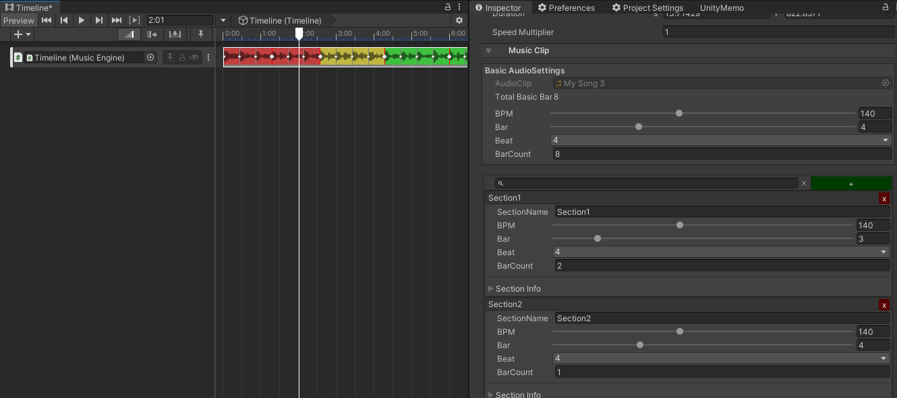
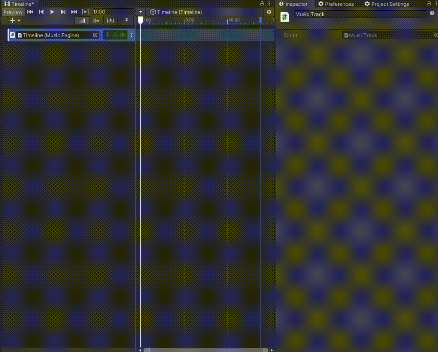

# MusicTimeline ver0.1
MusicTimeline is useful when you want to create a production that is synchronized with music in a timeline.  
This asset made from [MusicEngine](https://github.com/geekdrums/MusicEngine) algorithm.

# Usage
- Create GameObject with **MusicEngine** Component.
- Bind the GameObject with MusicTimeline Track.
- Create Timeline Clip from AudioClip and set Sections.

# TODO
- Editor Preview.
- Fix a bug when timeline is looping.
- Fix a bug when timeline has multiple clips.